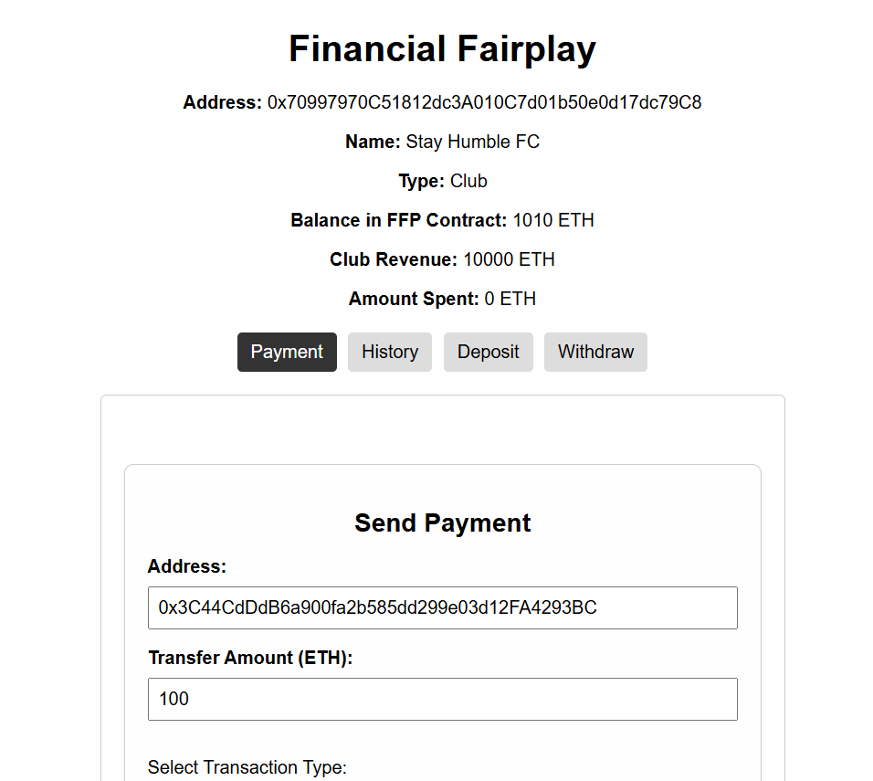

FFP ETH

api: api for offchain oracle
ffp_web: web for FFP client
offchain-oracle: offchain oracles connecting api and onchain oracle
sc: Oracle and FFP Smart Contract

Steps:
1. Initialize network with Kurtosis or Hardhat for dev. Get the private kesy and addresses for the wallets
2. Prepare the oracle addresses and the private keys
3. Deploy Oracle and FFP Smart Contract with deploy.js script
4. Initialize wallets for FFP with initWallet.js and depositWallet.js
5. Turn on the offchain oracle server.
6. Turn on the api server.
7. Run the client web code
8. Use it

Kurtosis private eth:
1. Make sure installed docker, kurtosis-cli
2. Run : `kurtosis run github.com/ethpandaops/ethereum-package --args-file ./network_params.yaml --image-download always`